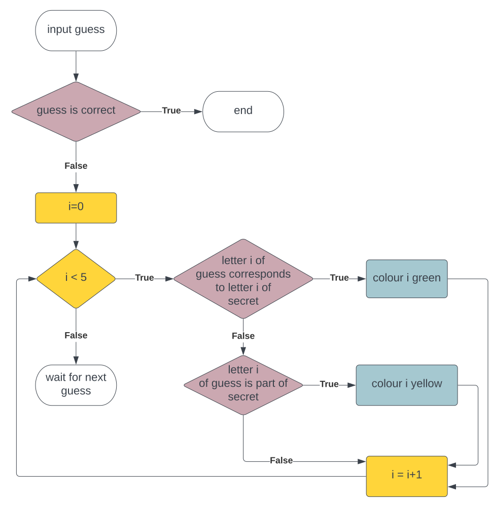

# Let's Code Wordle in Python

In this tutorial, you will learn how to write and customize your very own wordle game in Python.

During the tutorial, you will:
1. Grasp the key principles of imperative programming with Python
2. Discover how to turn real-world problems into algorithms via flowcharts
3. Learn how to build graphical user interfaces (GUIs) with Tkinter 
4. Put together all of these to write and customize a GUI-based wordle game

_If you are doing this as a visitor to [Computer Science at Durham University](https://www.durham.ac.uk/departments/academic/computer-science/) you will see how all of this plays together during a live coding session._ 

# Wordle in a Nutshell
_Wordle_ is a single-player word guessing game developed by Josh Wardle. Its (probably) most famous version can be found at the website of the [NY Times](https://www.nytimes.com/games/wordle/index.html) and can be played only once a day. 

In wordle, the player aims to guess a secret 5-letter word in at most 6 tries. The game responds to each try by colouring the letters of the guessed word as follows:
1. Green means the letter is part of the word and its position is correct
2. Yellow means the letter is part of the word but in another position
3. Gray means the letter is not part of the word at all

# Wordle Flowchart
Flowcharts are a graphical way to describe processes and algorithms.
Flowcharts consist of (at least) three types of nodes:
1. Rectangles with rounded corners: terminator nodes 
2. Rectangles: instruction nodes
3. Rhombuses: conditional nodes

The following flowchart depicts the the wordle rules for providing hints to the player - you may find it useful while coding through wordle.

# Getting Started
A few quick steps to get you started:

1. Ensure the computer is booted into Linux
2. Login with the provided username and password
3. Download this repo (_wordl-main.zip_) to your computer
4. Right click _Extract To..._> choose directory > _Extract_ to unzip it
5. Start Visual Studio Code (Menu: _Applications_ > _Programming_ > _Visual Studio Code_)
6. Within Visual Studio Code select _File_ > _New File_
    * Click _"Select a language"_ and choose _"Python"_
    * It will then say _"Do you want to install the recommended extensions for Python?"_
    * Click _"Install"_ and wait ~1 minute whilst everything is setup for you
7. Click _File_ > _Open File..._ to open one of the Python files in the _wordl-main_ directory
**You are now ready to start coding**

<!-- # Imperative Programming with Python -->
<!-- # Build a GUI with Tkinter -->

# Code Wordle
Subject to your previous programming experience, start with the following Python template:
- [**wordle_level1.py**](wordle_level1.py), if you have never programmed before (style: remove comment symbols)
- [**wordle_level2.py**](wordle_level2.py), if you have a bit of programming experience in any programming language (style: fill-in gaps)
- [**wordle_level3.py**](wordle_level3.py), if you have programming experience in Python (style: implement key function for wordle rules)
- **nothing**, if you prefer to start from scratch (Note: a console-based wordle can be written in 20 lines of Python)

# Make it yours!
The following coding ideas are ordered by increasing levels of difficulty. Feel free to start with whichever idea you feel comfortable with (or, even better, implement your own ideas!):
1. **Customize wordle**:
    - Apply a different colour scheme
    - Change font
    - Ask for words from a specific topic (Harry Potter, geordie dialect, computer science, food,  ...)
    - Ask for words in another language 
2. **Make wordle easier**:
    - Increase the number of allowed guesses
    - Provide hints to the user
3. **Make wordle harder**:
    - Longer words/fewer guesses (Could a perfect player always win the game with the specified number of guesses?)
    - Prohibit guesses that are not in the dictionary 
4. **Tweak wordle**:
    - [ill-wordle](https://alexpeattie.com/blog/establishing-minimum-guesses-wordle/): Find the secret word ending with _ills_.
    - [primel](https://converged.yt/primel/): Find the secret prime number.
    - [numberle](https://numberle.org/): Guess the equation.
    - [absurdle](https://qntm.org/absurdle): An adversarial variant of wordle. 

# Become a Guru in Wordle Theory and Practice

**Warning**: May contain advertising.

**Can't get enough about algorithms and flow charts?** 
Dive into _[Algorithms and Data Structures (COMP1081)](https://www.dur.ac.uk/faculty.handbook/module_description/?year=2021&module_code=COMP1081)_ at Durham University.

**Want to learn more about this fancy list comprehension stuff?** 
Attend our course on _[Programming Paradigms (COMP2221)](https://www.dur.ac.uk/faculty.handbook/module_description/?year=2021&module_code=COMP2221)_.

**Tired of setting up interesting word lists manually?** 
Dive into _[Data Science (COMP2271)](https://www.dur.ac.uk/faculty.handbook/module_description/?year=2021&module_code=COMP2271)_ at Durham University.

**Tired of solving wordl yourself?** 
Get into _[Artificial Intelligence (COMP2261)](https://www.dur.ac.uk/faculty.handbook/module_description/?year=2021&module_code=COMP2261)_ and develop an AI player that solves wordle.

**Want to solve thousands of wordles at the same time?** 
Join our [Student Cluster Competition](https://scicomp.webspace.durham.ac.uk/events/scc/) team.

**Have yet another fancy wordle idea?** 
Find teammates and attend [DurHack](https://durhack.com/)!

**Making a long story short: Study at [Durham University](https://www.durham.ac.uk)!**
